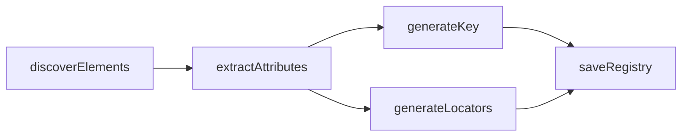

# Locator MCP Optimization Plan

## Current State and Pain Points

Your pipeline today is linear and attribute-only:



**What works well:**
- Per-`scanName` registry files (token savings vs monolithic `locators.json`)
- Dynamic `data-testid` detection with `contains()` + templates in [`generate-locators.ts`](locator-mcp/src/scanner/generate-locators.ts)
- Priority chain: testId → id → text → class

**What hurts quality today** (visible in [`goal-side-panel-locators.json`](locator-mcp/registry/goal-side-panel-locators.json)):

| Problem | Example | Impact |
|---------|---------|--------|
| Duplicate generic testIds | 29× `box`, 18× `flex` | All get identical `//*[@data-testid='box']` — unusable |
| Flat XPath only | No parent/sibling context | Cannot disambiguate duplicates |
| `textContent` = full subtree | One `box` entry has 200+ chars of nested text | Bloated registry + bad text locators |
| Broad discovery | `[class]` matches every styled `div` | ~90% noise, high token cost |
| No uniqueness check | Locators saved without validation | AI picks locators that match 0 or many elements |
| Hash CSS classes | `twigs-c-PJLV-ibHvUxT-css` | Brittle locators |

[`generateLocators`](locator-mcp/src/scanner/generate-locators.ts) cannot produce relational XPaths today because it receives only flat attributes — no DOM tree, no ancestors, no siblings.

---

## Phase 1 — Relational XPath (Highest Impact)

### 1A. Extract DOM context per element

Extend [`extract-attributes.ts`](locator-mcp/src/scanner/extract-attributes.ts) (or add `extract-element-context.ts`) to collect in a **single `element.evaluate()`**:

```ts
interface ElementContext {
  tagName: string;
  directText: string | null;       // TEXT_NODE children only, not full subtree
  attributes: {
    testId, id, className,
    role, ariaLabel, placeholder, name, type, href
  };
  ancestors: Array<{               // walk up to 6 levels
    tagName: string;
    testId: string | null;
    id: string | null;
    role: string | null;
    ariaLabel: string | null;
  }>;
  precedingLabel: string | null;   // nearest label/legend text before element
  siblingIndex: number | null;     // among same-tag siblings under same parent
}
```

**Key fix:** replace `el.textContent` with direct-text extraction:

```js
[...el.childNodes]
  .filter(n => n.nodeType === Node.TEXT_NODE)
  .map(n => n.textContent?.trim())
  .filter(Boolean)
  .join(' ')
```

### 1B. New `generate-relational-xpath.ts`

Generate **ranked candidates** instead of one flat XPath:

**Strategy A — Ancestor-scoped (for duplicate testIds like `box`/`flex`):**
```
//div[@data-testid='goal-side-panel']//div[@data-testid='box'][.//button[text()='Save']]
//div[@data-testid='add-participants_flex']//button
```

Algorithm:
1. If element's own testId is unique on page → keep current flat XPath (high confidence)
2. If duplicate → walk `ancestors[]`, pick nearest ancestor with a **unique, non-generic** testId
3. Build: `//{ancestor}//*[@data-testid='{child}']` optionally narrowed by `tagName` or `directText`
4. Stop at first ancestor that makes the scoped XPath unique

**Strategy B — Label/sibling (for form fields without testId):**
```
//label[normalize-space()='Due by']/following-sibling::div[1]
//div[@data-testid='weightage']//span[text()='Weightage(s)']/ancestor::div[1]//input
```

**Strategy C — Positional fallback (low confidence, last resort):**
```
(//div[@data-testid='box'])[3]
```

### 1C. Uniqueness validation at scan time

In [`scanner.service.ts`](locator-mcp/src/scanner/scanner.service.ts), after generating candidates, validate on the live page:

```ts
const count = await page.locator(`xpath=${candidate}`).count();
```

Only persist locators where `count === 1`. Store metadata:

```ts
interface LocatorTemplates {
  xpath?: string;              // best unique flat or relational
  xpathRelational?: string;    // explicitly tagged relational
  xpathTemplate?: string;
  confidence: 'high' | 'medium' | 'low';
  matchCount: number;          // 1 = good, >1 = duplicate, 0 = broken
  strategy: 'testId' | 'ancestorScoped' | 'labelSibling' | 'text' | 'class';
}
```

### 1D. Generic testId denylist

In [`constants.ts`](locator-mcp/src/shared/constants.ts), add:

```ts
export const GENERIC_TEST_IDS = new Set(['box', 'flex', 'container', 'wrapper', 'root']);
```

If testId is generic, **skip flat XPath** and go straight to ancestor-scoped generation.

---

## Phase 2 — Smarter Discovery (Reduce Noise + Tokens)

### 2A. Tiered scan modes

Add `scanMode` to `scan_page`:

- `interactive` (default) — `button, input, textarea, select, a, [role=button|link|textbox|combobox]`
- `testId` — only `[data-testid]` elements (skip bare `[class]` matches)
- `full` — current behavior

This alone could cut registry size from ~100 entries to ~20–30 actionable ones per panel.

### 2B. Filter unstable classes

Skip class-based locators when class matches hash patterns:
```
/^[a-z]+-c-[A-Z]+/   // twigs/stitches-style hashed classes
/-[a-zA-Z0-9]{6,}-css$/
```

### 2C. Batch DOM extraction (performance)

Replace per-element `evaluate()` loop with one `page.evaluate()` that returns all element contexts at once. Current loop in [`scanner.service.ts`](locator-mcp/src/scanner/scanner.service.ts) does 2×N round-trips (tag check + attribute extract) — batching cuts scan time significantly on large pages.

---

## Phase 3 — MCP API for Token Efficiency

Extend [`server.ts`](locator-mcp/src/server.ts) with targeted read tools:

| Tool | Returns | Token savings |
|------|---------|---------------|
| `list_registries` | filenames in `registry/` | tiny |
| `get_registry_keys` | `{ key, tagName, testId, confidence }[]` | ~10× smaller than full registry |
| `get_locator` | single element by `scanName` + `key` | minimal |
| `search_registry` | filter by `tagName`, `testId`, `text`, `confidence` | scoped reads |

Update `scan_page` response to include `registryFile` so the AI knows exactly which file to query.

Fix `get_registry` to return a clear error (not `{}`) when file is missing, optionally listing available registries.

---

## Phase 4 — Key Generation and Registry Quality

### 4A. Context-aware keys

Update [`generate-key.ts`](locator-mcp/src/scanner/generate-key.ts) to use ancestor context when testId is generic:

```
box + ancestor add-participants_flex → addParticipantsFlexSaveButton
box (no ancestor) + text Save → boxSave
```

### 4B. Deduplicate registry entries

When two elements resolve to the same unique XPath, merge into one entry with `aliases: string[]` instead of `box`, `box2`, `box3`.

### 4C. Post-scan summary in response

Return alongside `sample`:

```json
{
  "stats": {
    "total": 87,
    "unique": 42,
    "duplicate": 31,
    "lowConfidence": 14,
    "interactive": 28
  },
  "warnings": [
    "29 elements share testId 'box' — relational XPath applied",
    "14 elements have matchCount > 1"
  ]
}
```

---

## Phase 5 — Tests and Tooling

Expand [`tests/scanner.spec.ts`](locator-mcp/tests/scanner.spec.ts):

- Relational XPath: duplicate testId + unique ancestor → scoped XPath
- Label sibling: `label` + `input` without testId
- Generic testId denylist skips flat XPath
- Direct text vs subtree text
- Uniqueness scoring (`matchCount`)
- `confidence` assignment rules

Add fixture HTML snippets (inline or small files) for deterministic DOM-tree tests without a live browser.

---

## Proposed File Changes

```
locator-mcp/src/scanner/
  extract-element-context.ts   NEW — DOM tree + direct text + ancestors
  generate-relational-xpath.ts NEW — ranked candidate generation
  generate-locators.ts           MODIFY — delegate to relational module
  validate-locator.ts          NEW — page.locator count check
  scanner.service.ts             MODIFY — batch extract, validate, stats
  scanner.types.ts               MODIFY — extend LocatorTemplates + ElementContext

locator-mcp/src/shared/
  constants.ts                   MODIFY — generic testIds, hash class patterns, scan modes

locator-mcp/src/server.ts        MODIFY — new MCP tools, registryFile in response
```

---

## Example: Before vs After

**Before** (current — 29 identical entries):
```json
"xpath": "//*[@data-testid='box']"
```

**After** (relational + validated):
```json
{
  "xpath": "//div[@data-testid='goal-side-panel']//div[@data-testid='box']//button[normalize-space()='Save']",
  "xpathRelational": "//div[@data-testid='goal-side-panel']//button[normalize-space()='Save']",
  "confidence": "high",
  "matchCount": 1,
  "strategy": "ancestorScoped"
}
```

---

## Recommended Implementation Order

1. **Direct text fix + generic testId denylist** — quick wins, no new architecture
2. **Element context extraction (ancestors + labels)** — unlocks relational XPath
3. **Relational XPath generator + uniqueness validation** — core feature you asked for
4. **Interactive scan mode** — cuts registry noise dramatically
5. **MCP read tools (`get_registry_keys`, `get_locator`)** — token optimization for AI usage
6. **Batch extraction + tests** — performance and regression safety
