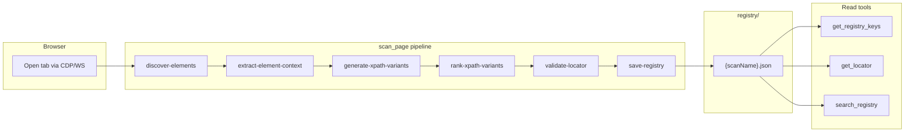

# locator-mcp

MCP server that scans live browser pages and builds structured locator registries for test automation. Connects to Chrome via CDP or Playwright WebSocket, discovers elements, generates ranked XPath/CSS/testId locators (including relational XPaths for duplicate `data-testid` values), validates uniqueness on the page, and saves per-page JSON registries that AI clients can read incrementally.

Built for use alongside **Playwright MCP** — navigate and interact with the browser using Playwright MCP, then call `scan_page` to capture locators into a registry.

---

## Table of contents

- [Features](#features)
- [How it works](#how-it-works)
- [Prerequisites](#prerequisites)
- [Quick start](#quick-start)
- [Run locally](#run-locally)
- [MCP configuration](#mcp-configuration)
- [MCP tools reference](#mcp-tools-reference)
- [Scan modes](#scan-modes)
- [Registry format](#registry-format)
- [Token-efficient workflow](#token-efficient-workflow)
- [Project structure](#project-structure)
- [Development](#development)
- [Testing](#testing)
- [Git conventions](#git-conventions)
- [Troubleshooting](#troubleshooting)

---

## Features

- **Live page scanning** — connects to an already-open browser tab (no headless relaunch)
- **Per-page registries** — each scan saves to `registry/{scanName}.json` for targeted reads
- **Relational XPath** — ancestor-scoped and label-sibling XPaths disambiguate duplicate generic testIds (`box`, `flex`, etc.)
- **Multi-strategy locators** — testId, id, aria, form attributes, text, class, positional fallbacks
- **Uniqueness validation** — each locator is checked on the live page (`matchCount`, `confidence`)
- **Dynamic testId templates** — detects unstable suffixes and emits `contains()` + template XPaths
- **Three scan modes** — `interactive` (default), `testId`, `full` to control noise vs coverage
- **Token-efficient read tools** — `get_registry_keys` and `get_locator` vs full `get_registry`
- **Portable MCP config** — committed `.cursor/mcp.json` with `${workspaceFolder}` support

---

## How it works



1. **Discover** — query the DOM using mode-specific selectors (`interactive`, `testId`, or `full`)
2. **Extract context** — per element: attributes, direct text, ancestor chain (up to 6 levels), label siblings
3. **Generate variants** — XPath candidates across 9 tiers (testId → relational → text → class → positional)
4. **Rank & validate** — score variants, verify `matchCount` on the live page, pick recommended + fallbacks
5. **Save** — write `registry/{scanName}.json` with keys, metadata, and locator bundles
6. **Read** — AI client fetches keys first, then individual entries as needed

---

## Prerequisites

- **Node.js** 18+ (tested on Node 24)
- **npm**
- **Google Chrome** (for CDP mode) or a Playwright browser server (for WebSocket mode)
- **Cursor** or **Claude Desktop** for MCP integration

---

## Quick start

```bash
git clone https://github.com/Eswarr11/locator-mcp.git
cd locator-mcp          # folder name may differ on your machine
npm install
```

1. Open the cloned folder as your **Cursor workspace**
2. [`.cursor/mcp.json`](.cursor/mcp.json) is preconfigured — reload MCP: **Cmd+Shift+J → MCP**
3. Launch Chrome with remote debugging (see [With Playwright MCP](#with-playwright-mcp-for-scan_page))
4. Navigate to your target page using Playwright MCP
5. Call `scan_page` with a `scanName` and `cdpEndpoint`

---

## Run locally

| Command | Description |
|---------|-------------|
| `npm run mcp` | Start MCP server via `tsx` — used by Cursor / Claude |
| `npm run dev` | Same as `mcp`, for terminal development |
| `npm run build` | Compile TypeScript to `dist/` |
| `npm start` | Run compiled server (`node dist/server.js`) |
| `npm test` | Run unit tests |

```bash
# MCP server (stdio transport — used by Cursor / Claude)
npm run mcp

# Production
npm run build && npm start
```

---

## MCP configuration

Run `npm install` in the repo before connecting.

> **Why not `cwd` + relative paths?** Global `~/.cursor/mcp.json` ignores `cwd`, so relative paths like `src/server.ts` resolve from your home directory and fail with `ERR_MODULE_NOT_FOUND`. Use the committed **project** config or `npm run mcp --prefix <abs-path>`.

### Cursor (project) — recommended

[`.cursor/mcp.json`](.cursor/mcp.json) is committed. Open this repo as your workspace — no manual edits needed:

```json
{
  "mcpServers": {
    "locator-mcp": {
      "command": "npm",
      "args": ["run", "mcp", "--prefix", "${workspaceFolder}"]
    }
  }
}
```

`${workspaceFolder}` resolves to the project root automatically. Reload MCP after clone: **Cmd+Shift+J → MCP**.

If `locator-mcp` is also defined in global `~/.cursor/mcp.json`, remove one entry to avoid duplicate servers.

### Cursor (global)

For use across workspaces, add to `~/.cursor/mcp.json`:

```json
"locator-mcp": {
  "command": "npm",
  "args": ["run", "mcp", "--prefix", "<path-to-repo>"]
}
```

Example for this machine:

```json
"locator-mcp": {
  "command": "npm",
  "args": ["run", "mcp", "--prefix", "/Users/eswar/Desktop/locator-collector"]
}
```

### Claude Desktop

Claude does not support `${workspaceFolder}`. Edit:

`~/Library/Application Support/Claude/claude_desktop_config.json`

```json
{
  "mcpServers": {
    "locator-mcp": {
      "command": "npm",
      "args": ["run", "mcp", "--prefix", "<path-to-repo>"]
    }
  }
}
```

Restart Claude Desktop after saving.

### Production (compiled)

Run `npm run build` first, then point MCP at the compiled output:

```json
"locator-mcp": {
  "command": "node",
  "args": ["<path-to-repo>/dist/server.js"]
}
```

### With Playwright MCP (for `scan_page`)

`scan_page` does not launch a browser — it connects to one that is already open. Pair with Playwright MCP on the same CDP endpoint (typically in global `~/.cursor/mcp.json`):

```json
{
  "mcpServers": {
    "playwright": {
      "command": "npx",
      "args": [
        "@playwright/mcp@latest",
        "--cdp-endpoint",
        "http://localhost:9222"
      ]
    },
    "locator-mcp": {
      "command": "npm",
      "args": ["run", "mcp", "--prefix", "<path-to-repo>"]
    }
  }
}
```

**Step 1 — Launch Chrome with remote debugging:**

```bash
open -a "Google Chrome" --args --remote-debugging-port=9222 --user-data-dir=/tmp/pw-chrome
```

**Step 2 — Navigate** to your target page using Playwright MCP tools.

**Step 3 — Scan** with locator-mcp:

```json
{
  "cdpEndpoint": "http://localhost:9222",
  "scanName": "goal-side-panel-locators",
  "scanMode": "interactive"
}
```

Optional: pass `pageUrl` (substring) to target a specific tab when multiple are open.

---

## MCP tools reference

### `scan_page`

Scan an open browser page and save locators to `registry/{scanName}.json`.

| Parameter | Required | Description |
|-----------|----------|-------------|
| `cdpEndpoint` | One of CDP/WS | CDP HTTP URL, e.g. `http://localhost:9222` |
| `wsEndpoint` | One of CDP/WS | Playwright WebSocket URL, e.g. `ws://127.0.0.1:PORT/...` |
| `scanName` | Yes | Registry filename without `.json` |
| `scanMode` | No | `interactive` (default), `testId`, or `full` |
| `pageUrl` | No | URL substring to pick a specific tab |

**Example response (abbreviated):**

```json
{
  "scanId": "goal-side-panel-locators",
  "registryFile": "registry/goal-side-panel-locators.json",
  "pageUrl": "https://app.example.com/goals",
  "scannedAt": "2026-06-23T12:00:00.000Z",
  "totalElements": 42,
  "registrySaved": true,
  "stats": {
    "total": 42,
    "unique": 38,
    "duplicate": 4,
    "lowConfidence": 2,
    "interactive": 30
  },
  "warnings": [
    "5 elements share generic testId 'box' — relational XPath applied"
  ],
  "sample": [ "...first 5 elements..." ]
}
```

---

### `list_registries`

List all available registry files in `registry/`.

```json
{ "registries": ["goal-side-panel-locators", "goal-create-side-panel-v2"] }
```

---

### `get_registry_keys`

Return a lightweight list of element keys — **use this before fetching individual locators**.

| Parameter | Required | Description |
|-----------|----------|-------------|
| `scanName` | Yes | Registry filename without `.json` |

**Returns per key:** `key`, `tagName`, `testId`, `confidence`, `matchCount`, `strategy`

Much smaller than `get_registry` — typically 90%+ token savings on large pages.

---

### `get_locator`

Fetch a single element entry by key.

| Parameter | Required | Description |
|-----------|----------|-------------|
| `scanName` | Yes | Registry filename without `.json` |
| `key` | Yes | Element key from `get_registry_keys` |

**Returns:** `key`, `tagName`, `text`, `attributes`, `locators` (`recommended`, `fallbacks`, `xpath`, `confidence`, `matchCount`, `strategy`)

---

### `get_registry`

Return the **full** registry JSON. High token cost — prefer `get_registry_keys` + `get_locator`.

| Parameter | Required | Description |
|-----------|----------|-------------|
| `scanName` | Yes | Registry filename without `.json` |

---

### `search_registry`

Filter registry entries by attributes.

| Parameter | Required | Description |
|-----------|----------|-------------|
| `scanName` | Yes | Registry filename without `.json` |
| `tagName` | No | Exact HTML tag match, e.g. `button` |
| `testId` | No | Substring match on `data-testid` |
| `text` | No | Substring match on direct text |
| `confidence` | No | `high`, `medium`, or `low` |

All provided filters are combined with AND logic.

---

## Scan modes

| Mode | Selectors | Best for |
|------|-----------|----------|
| `interactive` (default) | Buttons, inputs, links, roles + attributed elements | Most UI pages — low noise, high signal |
| `testId` | `data-testid`, `data-test`, `data-qa`, `data-cy` only | Apps with consistent test IDs |
| `full` | All candidate attributes including `[class]` | Maximum coverage — expect more noise |

**Recommendation:** start with `interactive`. Switch to `testId` when the app has good testId coverage. Use `full` only when you need exhaustive discovery.

---

## Registry format

Each scan writes `registry/{scanName}.json` — a map of element keys to metadata:

```json
{
  "saveButton": {
    "key": "saveButton",
    "tagName": "button",
    "text": "Save",
    "attributes": {
      "testId": "goal-form_button_save",
      "id": null,
      "role": null,
      "ariaLabel": null,
      "placeholder": null
    },
    "locators": {
      "recommended": {
        "xpath": "//button[@data-testid='goal-form_button_save']",
        "tier": 1,
        "strategy": "testId",
        "matchCount": 1,
        "confidenceScore": 90
      },
      "fallbacks": [ "..." ],
      "xpath": "//button[@data-testid='goal-form_button_save']",
      "confidence": "high",
      "matchCount": 1,
      "strategy": "testId"
    }
  }
}
```

**Locator confidence:**

| Level | Meaning |
|-------|---------|
| `high` | `matchCount === 1`, stable strategy (testId, id, relational) |
| `medium` | Unique but weaker strategy (text, aria) |
| `low` | `matchCount > 1` or positional/generic fallback |

Registry JSON files are **gitignored** — generated locally via `scan_page`. Only `registry/.gitkeep` is committed to preserve the folder.

---

## Token-efficient workflow

For AI clients reading registries, follow this order to minimize token usage:

```
1. list_registries          → see what's available
2. get_registry_keys        → lightweight key list (~500–4k tokens)
3. get_locator (per key)    → single entry (~100–200 tokens each)
   OR search_registry       → filtered subset

Avoid: get_registry         → full file (10k–80k+ tokens)
```

| Registry size | `get_registry` (est.) | `get_registry_keys` (est.) |
|---------------|----------------------|---------------------------|
| ~39 KB | ~10,000 tokens | ~500–1,000 tokens |
| ~321 KB | ~80,000 tokens | ~2,000–4,000 tokens |

Estimates use `characters / 4` — good for relative comparison, not exact billing.

---

## Project structure

```
locator-mcp/
├── .cursor/
│   ├── mcp.json              # Cursor MCP config (committed, portable)
│   └── rules/                # Cursor AI rules for this repo
├── registry/
│   └── .gitkeep              # Scan output dir (JSON files gitignored)
├── src/
│   ├── server.ts             # MCP tool definitions
│   ├── index.ts              # Package entry
│   ├── scanner/
│   │   ├── scanner.service.ts        # Scan orchestration
│   │   ├── discover-elements.ts      # DOM element discovery by scan mode
│   │   ├── extract-element-context.ts # Attributes, ancestors, labels
│   │   ├── generate-xpath-variants.ts
│   │   ├── generate-relational-xpath.ts
│   │   ├── rank-xpath-variants.ts
│   │   ├── validate-locator.ts
│   │   ├── generate-key.ts
│   │   ├── detect-dynamic-value.ts
│   │   ├── generate-locators.ts
│   │   ├── save-registry.ts
│   │   └── scanner.types.ts
│   └── shared/
│       ├── constants.ts      # Selectors, scan modes, deny lists
│       ├── registry.ts       # Registry file I/O
│       └── utils.ts
├── tests/
│   └── scanner.spec.ts       # Unit tests
├── package.json
├── tsconfig.json
└── README.md
```

---

## Development

```bash
# Install dependencies
npm install

# Run MCP server in terminal (stdio)
npm run dev

# Run tests
npm test

# Compile TypeScript
npm run build
```

**Key conventions:**

- ESM imports with `.js` extension: `import { x } from './foo.js'`
- XPath locators prefer `data-testid`: `//tag[@data-testid="..."]`
- Relational XPaths disambiguate duplicate generic testIds
- Registry path: `registry/{scanName}.json`

See [`.cursor/rules/`](.cursor/rules/) for full AI coding standards.

---

## Testing

```bash
npm test
```

Uses Node built-in test runner (`node:test`) with `tsx` for TypeScript. Tests cover:

- XPath variant generation and scoring
- Generic testId disambiguation and relational XPath
- Dynamic value detection and templates
- Key generation with ancestor context
- Constants and denylist behavior

---

## Git conventions

**Committed:**

- Source (`src/`), tests, config, `.cursor/mcp.json`, `.cursor/rules/`
- `registry/.gitkeep` (empty folder placeholder)

**Not committed (`.gitignore`):**

| Path | Reason |
|------|--------|
| `node_modules/` | Dependencies — run `npm install` |
| `dist/` | Build output — run `npm run build` |
| `registry/*.json` | Local scan data — run `scan_page` |
| `.env*` | Secrets |

---

## Troubleshooting

### `Cannot find module '/Users/you/src/server.ts'`

Global `~/.cursor/mcp.json` ignored `cwd`. Fix: use project [`.cursor/mcp.json`](.cursor/mcp.json) or `npm run mcp --prefix <abs-path>`.

### `Failed to connect to browser`

- Chrome must be running with `--remote-debugging-port=9222`
- Playwright MCP must use the same `--cdp-endpoint`
- Relaunch Chrome:

```bash
open -a "Google Chrome" --args --remote-debugging-port=9222 --user-data-dir=/tmp/pw-chrome
```

### `Connected to browser but no open page was found`

Open at least one tab in the debug Chrome instance before calling `scan_page`.

### `registry '{scanName}.json' not found`

Run `scan_page` first, or call `list_registries` to see available files.

### Duplicate / low-confidence locators

- Use `scanMode: "interactive"` to reduce noise
- Check `warnings` in the `scan_page` response
- Prefer entries with `confidence: "high"` and `matchCount: 1`
- For duplicate generic testIds, relational XPaths are generated automatically

### MCP server shows twice in Cursor

Remove `locator-mcp` from either global `~/.cursor/mcp.json` or project `.cursor/mcp.json` — keep only one.
